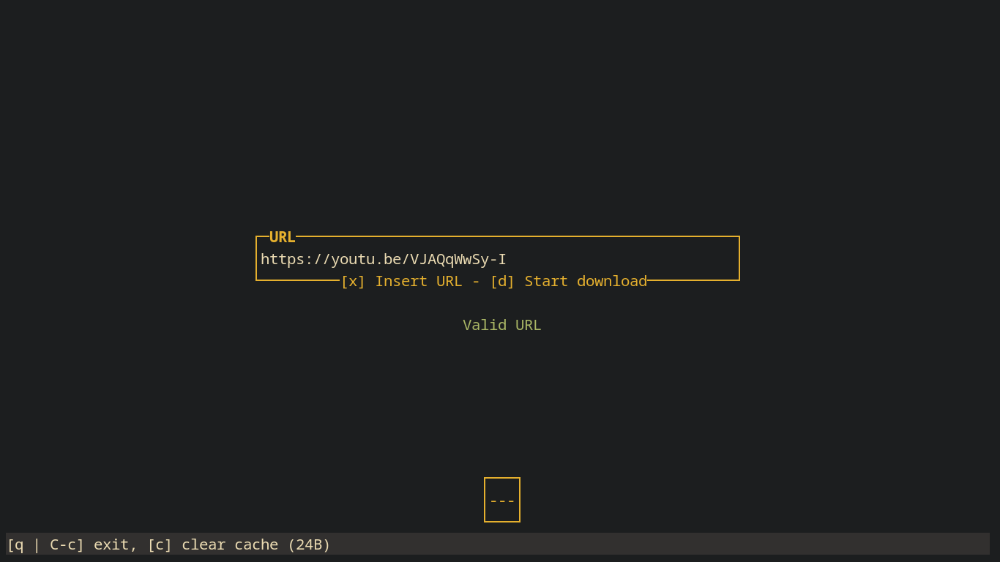
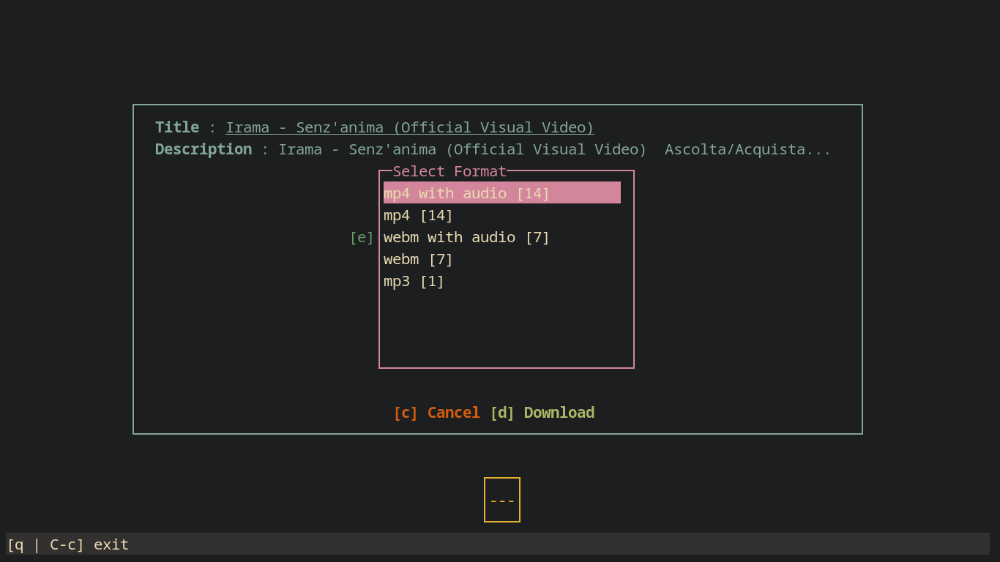

# DLP (Download PLayer)

|                                |                                |
| ------------------------------ | ------------------------------ |
|  |  |

DLP is a CLI TUI tool that uses yt-dlp to download content
from platforms such as YouTube, Instagram, and TikTok, provided that
the user has permission to do so.

This project does not circumvent DRM systems and does not distribute copyrighted content. Use of this tool is the responsibility of the user.

### Installation

```bash
npm i -g dlp-cli
```

### Dependencies (Required)

- [yt-dlp](https://github.com/yt-dlp/yt-dlp) (In its latest version)
- [deno](https://docs.deno.com/runtime/getting_started/installation/) Recommended dependency by yt-dlp
- [ffmpeg](https://ffmpeg.org/download.html) Manipulation of videos and audio recordings
- [aria2](https://aria2.github.io/) Download files quickly

### Usage

```bash
dlp ## Open the TUI interface
```

```bash
dlp --version ## or -v Get DLP version
```

DLP is very intuitive and easy to use; you will have no trouble understanding it.

### Where are files saved?

Files are saved in a folder called `dlp` in the user's home directory.
At the end of each video or audio download, it will tell you exactly where it was saved.

---

Please report any errors you find [here](https://github.com/FedYou/dlp/issues/new), and I will try to fix them as soon as possible.
Add the video URL and the output so that I can reproduce the error.
